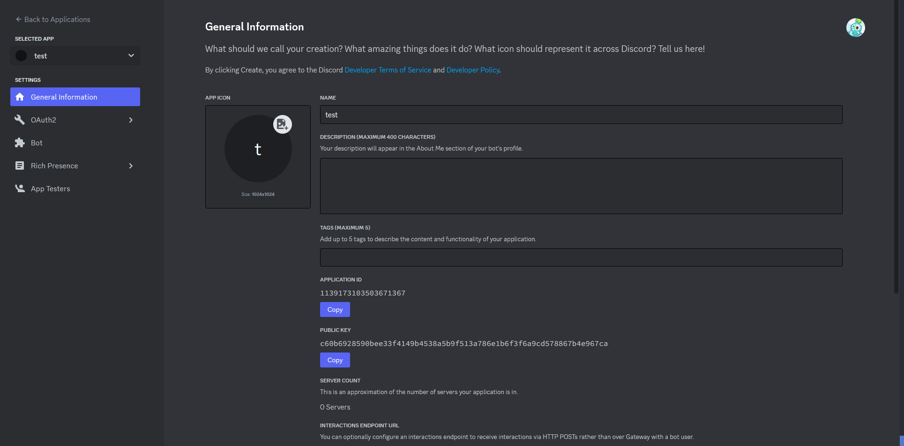
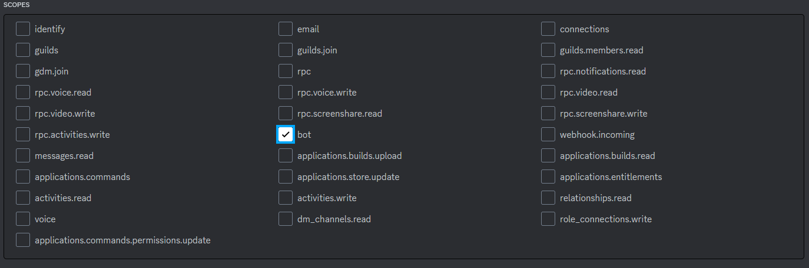

# Soulbot

## Description

Soulbot is a Discord bot build using Discord.py that provides functionalities to ease the work of TO of the Soul Cup staff.

## Installation

### Prerequisites 

- Python 3.8 pr higher is required
- Discord.py
- dotenv (optional)

### Setup

1. Clone this repository to your local machine.
2. Install the required dependencies if your computer doesn't have it :
    - For Python : [Python download](https://www.python.org/downloads/)
    - For dotenv: ```pip install dotenv```
    - For discord.py: ```pip install discord.py```
3. Create anew Discord bot on the [Discord Developer Portal](https://discord.com/developers/applications)
    - Click on the button "New Application"
    - Discord will ask you to prompt for an app name, choose the one which fit your liking
    - You will arrive on "General Information" of your Discord Bot 
    - Go on **Bot** tab and click on the button ```Reset Token```, it will generate a token, WHICH YOU SHOULD KEEP SAFE AT ALL COST
    - Create a .env and set your token there ```DISCORD_TOKEN=<YOUR_BOT_TOKEN>``` which you will retrieve in your code with dotenv package
    - To invite the bot on a server, go to **OAuth2** tab then **URL Generator**, which will allow you to define permissions for the bot.
    - Define the scope as a bot , then bot permissions. Use the link at the bottom in your browser to allow the bot
4. To run the bot locally on your computer, run the following command ```python main.py```, which will make the bot online

## Features
- The bot doesn't really have features for now but it will evolves with times, stay tuned.

## Commands
- SoulBot uses Slash Commands, which are integrated in Discord. To use a specific command, start your message with "/" followed by the feature you want to use.